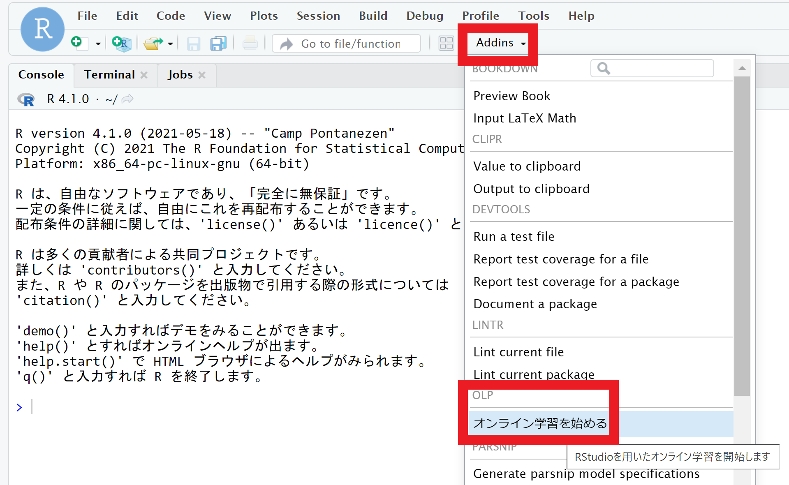
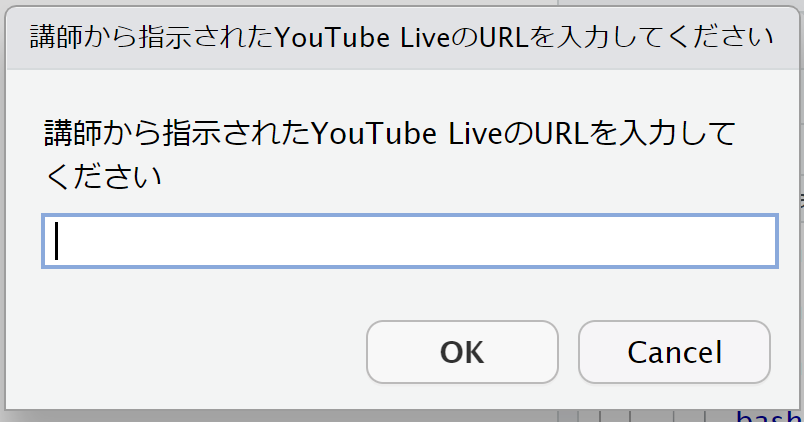
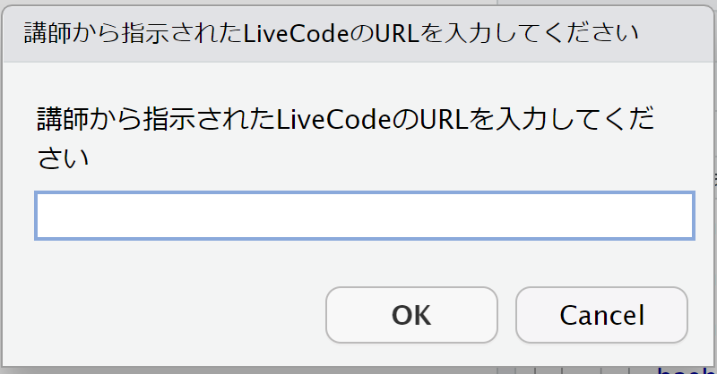
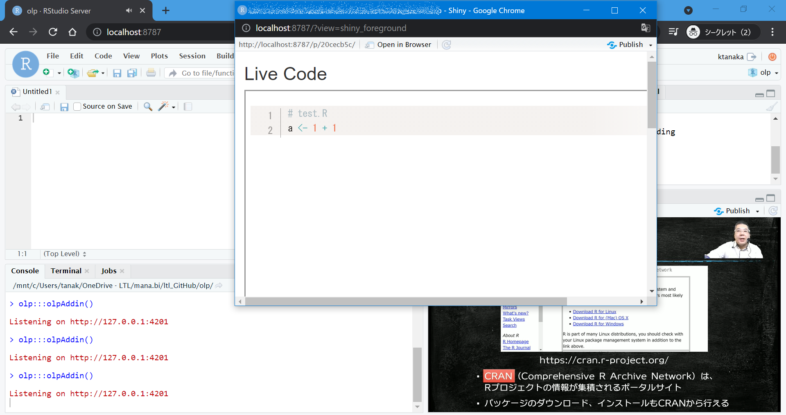

# olp: RStudioを用いたオンライン授業をサポートするためのパッケージ

<div align="right">
タナカケンタ<br />
<a href="https://mana.bi/">https://mana.bi/</a>
</div>

## 注意: 20210614

自分の手元ではいちおう動くことを確認しましたが、テストは不足しています。利用する場合には注意してください。


## このパッケージについて

[](https://www.youtube.com/watch?v=UYZZ6N02oto)

このパッケージは、RStudioのアドインです。RStudioを用いた、動画とライブコーディングによるオンライン授業を受講するための環境を提供します。"olp" は、Online Learning Preparationとか、そんなイメージです。CRANにそのような名前のパッケージがなかったので、そう命名しました。


## パッケージのインストール

パッケージは、GitHubで公開していますので、以下のように remotes パッケージの `install_github()` 関数でインストールしてください。

```r
remotes::install_github("ltl-manabi/olp")
```


## パッケージの使い方

パッケージをインストールすると、RStudioの "Addins" に、"オンライン学習を始める" というメニューが表示されます。



このメニューをクリックすると、RStudio上でダイアログが表示されます。





それぞれ、書いてある通りですが、講師から共有されたURLを入力し、"OK" を押してください。入力されたURLについては、何もチェックをしていないので、受講者がコピペミスなどでうまく表示されない、という場合は、もういちどアドインをメニューから選択し、やり直してください。あるいは、誰かそのような機能を実装してください。

URLを入力すると、RStudioのViewerペインに、YouTubeの講義動画が、別ウィンドウ (またはタブ) で講師が共有するライブコーディングのファイルが表示されます。



これで、受講の準備が整いましたので、あとは講師 (教員) の指示に従い、適宜動画とLive Codeを見ながら、学習してください。

なお、パッケージをインストールしたら、以降 `library()` などで読み込む必要はありません。


## パッケージの仕組み

開発者はシロウトなので、仕組みはシンプルで、以下のようなものです。

1. (講師側) 授業のオンライン配信はYouTube Liveで行う (一般公開でも限定公開でも、URLでアクセスできる形で)
1. (講師側) [Colin Rundel](https://github.com/rundel)氏による[livecode](https://github.com/rundel/livecode)パッケージで、講師が操作するRファイルを共有する (ここではLive Codeと呼びます)
    * livecodeパッケージでは、[ngrok](https://ngrok.com/)という仕組みを使い、ネットワークをトンネリングしてファイルを直接インターネットに公開する
    * 共有用のURLに[bit.ly](https://bitly.com/)を使うよう設定ができる (が、インターネット越しにアクセスできるURLではない)
1. (受講者側) [kazutan](https://github.com/kazutan)先生による[tubeplayR](https://github.com/kazutan/tubeplayR)パッケージでRStudioのペインに動画を表示する
1. (受講者側) `browseURL()` 関数でLive Codeを表示する
1. (受講者側) 上記を実現するために、YouTubeとLive CodeのURLを入力するダイアログを表示する

なお、このパッケージ (アドイン) は完全に受講者向けのもので、講師向けの機能はいっさいありません。講師は、授業の開始前に、それぞれ個別にYouTube Liveの配信準備と、livecodeパッケージによるファイルの共有をしておいてください。


## 講師側の準備

### YouTube Liveの準備

うまいこと準備してください。受講者がアクセスできるURLを取得してください。マイクやカメラの設定については、[研修講師のためのオンライン研修のノウハウシリーズ](https://mana.bi/wiki.cgi?page=%B8%A6%BD%A4%B9%D6%BB%D5%A4%CE%A4%BF%A4%E1%A4%CE%A5%AA%A5%F3%A5%E9%A5%A4%A5%F3%B8%A6%BD%A4%A4%CE%A5%CE%A5%A6%A5%CF%A5%A6%A5%B7%A5%EA%A1%BC%A5%BA)が参考になるかもしれません。


### ライブコーディングのインターネット越しの共有

上記のように、ライブコーディングの共有は、ngrokを用いています。デフォルトでは、ngrokは (あるいはlivecodeパッケージは) 同一LAN内での共有しかできません。インターネット越しに共有したい場合は、[livecodeのissue](https://github.com/rundel/livecode/issues/8)にあるように、別途[ngrokの実行ファイル](https://ngrok.com/download)をダウンロード、インストール (PATHの通ったところやカレントディレクトリに配置) し、`system()` 関数で外部に向けたトンネルを作成する必要があります。

ただ、RStudio CloudやWSL上で動かすRStudio Serverでは、`system()` 関数の実行結果がコンソールに返ってこないので、ローカルのURLを控えて、"Terminal" で

```bash
./ngrok http URL
```

としたほうが良いでしょう。そのようにして得られたURL (http://xxxx.ngrok.io) を受講者に共有してください。


### 環境の共有

Rをはじめて学ぶようなコースでは、受講者側にRとRStudioさえあればよいですが、ある程度発展的な、パッケージを活用するような内容では、動画とコードを共有するだけでは、受講者が環境を構築できないことがあります。オンライン授業で何が大変かというと、環境が準備できない人をサポートするところです。できるだけ、間違えようがない環境を用意する必要があります。

そこで、[RStudio Cloud](https://rstudio.cloud/)に、本パッケージを含め、必要なパッケージをインストールし、使用するファイルを配置したプロジェクトを構築し、それを受講者に共有することをオススメします。

RStudio Cloudでも (上記の方法で) ライブコーディングの共有ができることを確認したので、講師もRStudio Cloudを使用できます。


## ライセンス
GitHubリポジトリに設定している通り、MITライセンスです。